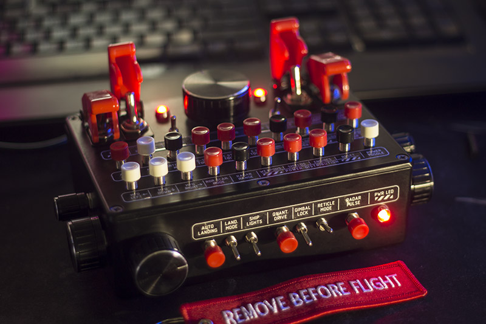

# RG Custom MK4 control panel

MK4 Control Panel is plug and play and does not require any drivers to operate. However to modify it`s firmware you might need latest Arduino IDE software. (1.6.6 or above). To connect your control panel to your PC you need to attach USB cable to control panel and connect it to PC. And you are ready to go. Your PC recognises MK4 as USB joystick with 4 axis inputs, 2 POV hat switches and 32 buttons. So you have to bind keys in Joystick section of game settings.
### AXIS INPUTS
There are 4 self calibrated axis inputs on MK4 control panel. X, Y, Z, rX. 
### PUSHBUTTONS
MK4 has 23 pushbuttons with simple action. You press and release or hold pushbuttons.
### TOGGLE SWITCHES
There are 10 toggle switches with pulse action. Each time you toggle switch it sends 30ms impulse on button activation on and off. So for example you activate toggle switch 1 and it sends command to push button 1, hold it for 30ms and release it. After that, when you will turn toggle switch off, it will do the same. Which is best used for toggling ingame systems like ship lights or landing gear.
### ROTARY ENCODERS
MK4 has 2 rotary encoders with pushbuttons onboard. Rotary encoders are working same as mouse wheel. You rotate it clockwise - it emulates impulses of button A, counterclockwise - it emulates impulses of button B. By default encoders emulate POV HAT2 L/R and U/D. Also rotary encoders have push action, if you press it. Whis works just as a simple pushbutton. 

### ANALOGUE AXIS INPUTS
MK4 Control Panel firmware uses auto calibration of all 4 axis inputs. Just turn each axis to min and max anytime and it will calibrate inputs. 
### !!!NEVER USE WINDOWS CALIBRATION UTILITY!!!

## USEFUL LINKS
RG Custom GitHub link Here you can find latest Arduino sketches for your control panel and this manual. https://github.com/RGCustom/mk4_control_panel

### Arduino sketch uses external libraries.
Info on how to install additional libraries can be found here. https://www.arduino.cc/en/Guide/libraries#toc4 

### Libraries included as submodules.
Arduino Joystick library 
LiquidCrystal_I2C  
Adafruit_NeoPixel  

## Contacts section:
Facebook https://www.facebook.com/RGcustom/  
RG Custom Discord channel https://discord.gg/tjndHQ7  
E-Mail: rgcustm@gmail.com  
IL-2 Forums (russian): https://forum.il2sturmovik.ru/topic/6511-opensource-kontroller-na-arduino/  
StarCitizen Spectrum thread: https://robertsspaceindustries.com/spectrum/community/SC/forum/50264/thread/open-source-arduino-controller-for-control-panels  

