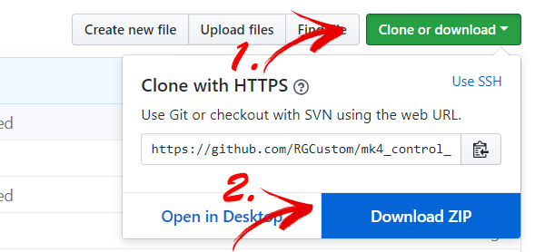

This is a short and easy manual on how to update your MK4 Control Panel firmware.
# STEP 1
Follow this link to https://www.arduino.cc and download and install latest Arduino IDE software
### First select SOFTWAREand choose DOWNLOADS

### Then select Windows installer

### Install Arduino IDE, following installer instructions.

# STEP 2
Go to MK4 Control Panel main GitHub directory https://github.com/RGCustom/mk4_control_panel and download firmware sketches
### First click on Clone or Download green buttons and select Download .ZIP

# STEP 3
Now download and install needed libraries (for MK4 basic only ArduinoJoystickLibrary needed)
### Libraries, included as submodules wont download on previous step, so they must be downloaded separately.

### Clicking on library will lead you to its location.
Donwload the same as you downloaded main sketch.

