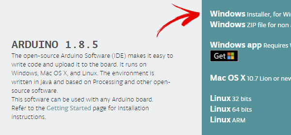

This is a short and easy manual on how to update your MK4 Control Panel firmware.
## STEP 1
go to https://www.arduino.cc and download and install latest Arduino IDE software
# First select SOFTWAREand choose DOWNLOADS

# Then select Windows installer

# Install Arduino IDE, following installer instructions.
